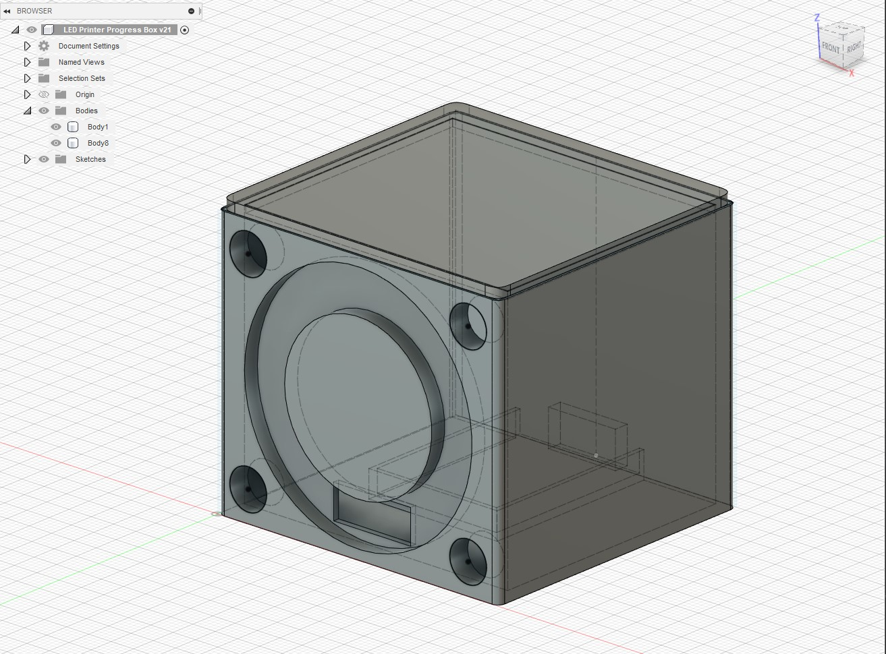

# 3D Printer Progress Box

This is an arduino sketch and a 3D printable model for a box that can be placed anywhere to give you status of your 3D printer & print progress.

## What does it do?

The requirements for my project were:

* A physical box that can be placed anywhere in the house
* Give power/wifi connection status
* Give OctoPrint connection status
* Nozzle / Bed temperature Status
* Progress bar for print progress

In the four corners of the box are LED's that give status for the nozzle warmup status, bed status, wifi, connection status, etc...

I've had this idea for a few years, but didn't know what I wanted it to look like.  I was thinking of putting a LED strip above the printer to show me status, but that would be limiting in where I could place it.  I then saw [this](https://www.youtube.com/watch?v=lTOuqMfCg7M&list=PLE9Um5NpNcs5u_P7cIbCNRe3nG3wy-gZ-&index=6&t=569s&ab_channel=pileofstuff) video which gave me the idea to go with a box that can sit on your desk.

## Getting Started

### What you'll need

* 3D Printer that is running OctoPrint
* Arduino compatible microcontroller connected to your wifi network (ESP8266 for example - I used a D1 MINI)
* API key generated from OctoPrint
* Ring of LED's
* LED holders
* USB cord for power

### Wiring Diagram

todo

### The 3D Model

I used this project as a learning experience for Fusion 360.  The model is made of 2 bodies 1) Lid 2) Box and they should be printed seprately.

## What's Next?

* There is a clean library that I didn't know existed for OctoPrint API that I want to switch to instead of my version.  That's located [here](https://github.com/chunkysteveo/OctoPrintAPI]).
* Defect fixes
* Handle more error codes with the LED ring (i.e. Flash the LED's when the filament runout sensor triggers)
* I realized after using the project that I needed a transparent cover for the ring of LED's since they look too exposed.  I lost my changes in fusion 360 due to a windows update so I need to re-create that.
* Add wiring diagram to the readme
